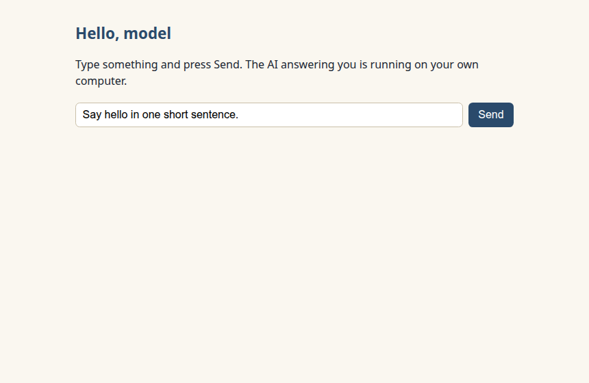
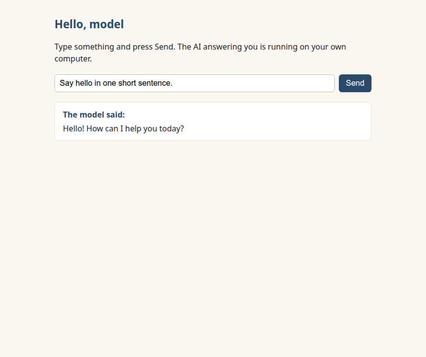
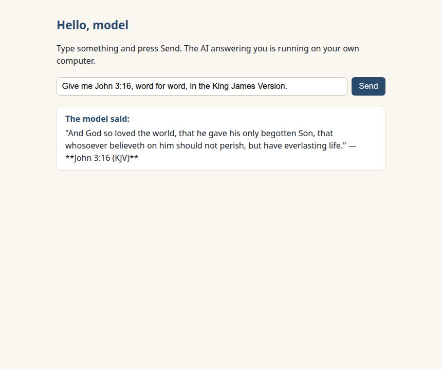

New here? Do the one-time [SETUP.md](../../SETUP.md) first.

# Lesson 1 — Another local server

In course 1 you asked a server for verses: a request goes to
`localhost:8000`, JSON comes back, your page shows it. Today you meet a
second server that's been sitting on your machine since setup — one that
answers in sentences. Same `fetch`, new port, very different neighbor.

## What we're building

A tiny page: a box to type something, a Send button, and the model's
reply appears below. It's all in one file, `index.html`, right here in
this folder.

## Run it and see it work

1. Start your local preview the way SETUP.md showed you — open this
   lesson's folder and click "Go Live" (or run the Python one-liner).
   The page opens at `http://localhost:5500`. It looks like this:

   

   **If you see "Ollama isn't running" instead** — that's not a broken
   page; that's the page taking care of you. Start Ollama (on Windows
   and Mac, launch the Ollama app; on Linux it's a background service:
   `sudo systemctl start ollama`), reload, and the message clears. For
   some of you this is genuinely the first screen you'll meet — now you
   know what it means.

2. The box already says `Say hello in one short sentence.` — click
   **Send**. A quiet "Thinking…" note appears, and then the reply lands,
   all at once:

   

   _That screenshot is one real run from one real machine — yours will
   differ, and that's normal. It's how models work, as you're about to
   see._

That's **the win**: an AI is running on your computer, and you just
talked to it from a page you control.

Now poke at it:

- Ask it anything — a riddle, a recipe, "explain fetch to me." Each
  Send is a fresh question.
- If a reply shows up wearing `**asterisks**` or little dashes, you're
  seeing the raw text that chat apps quietly _render_ into bold and
  bullets — your page shows the model's words exactly as they came.

### On the smaller model?

If SETUP routed you to `qwen3.5:2b`, open `index.html` in your editor
and find this line near the top of the script:

```js
const MODEL = "qwen3.5:4b"; // ← on the smaller model from SETUP? Make this "qwen3.5:2b" — that's the whole change
```

Make it say `"qwen3.5:2b"`, save, reload. That one line is the only
difference for the entire course.

## What just happened

You've done this exact loop before: **send a request → get JSON back →
put it on the page.** That was course 1, and it's still the whole trick.
The only thing that changed is the neighbor you're talking to:

```
course 1:  you → your page → localhost:8000  (Concord — answers with verses)
today:     you → your page → localhost:11434 (Ollama — answers in sentences)
```

The model isn't _in_ your page, and it isn't on the internet. It's
another local server — that's the whole idea of this lesson, and it's
why everything you learned in course 1 still works here.

## The code, piece by piece

Open `index.html` in your editor and follow along.

### Where Ollama is

```js
const OLLAMA = "http://localhost:11434"; // where Ollama lives — same idea as the CONCORD line in course 1, new port
const MODEL = "qwen3.5:4b";
```

Two constants: the address, and which model to ask for — Ollama can
hold several, so every request names one.

### The parcel

In course 1 every request was a plain _ask_ — a URL, nothing else. This
time you're _sending something_, so the request carries a parcel:

```js
const response = await fetch(`${OLLAMA}/api/chat`, {
  method: "POST", // "I'm bringing something," not just "show me something"
  headers: { "Content-Type": "application/json" }, // the label on the parcel
  body: JSON.stringify({
    model: MODEL,
    messages: [{ role: "user", content: text }],
    stream: false, // the whole answer at once
    think: false, // answer directly — no long private mulling first
  }),
});
```

You already turn JSON text into data with `.json()`. `JSON.stringify`
is the same door walked the other way — your data, turned back into
JSON text for the trip.

And `messages`? A chat is a list of turns. Today ours has exactly one —
yours, with `role: "user"`. (Later lessons add more turns to the list;
the shape never changes.)

### Reading the answer

```js
const data = await response.json();
// the reply's words live here:
data.message.content;
```

Same move as reading `verses` out of Concord's answer: find the field,
show the field. The page uses `textContent`, so the model's words land
exactly as they came.

### The two etiquette flags

`stream: false` asks Ollama for the whole answer at once — one request,
one JSON reply, exactly the pattern you know. The cost is honest: while
the model writes, your page waits. That's what the "Thinking…" note is
for, and on a machine without a graphics card the wait can reach half a
minute. Nothing is broken; the reply lands complete.

`think: false` asks the model to answer directly. This model can
"think" — write itself pages of private notes before answering — and
left to its own devices it will happily mull so long there's no room
left for the answer. We turn that off: lesson pages want the words, not
the diary. (You'll meet the useful side of model deliberation much
later; today it's just a flag.)

### When something goes wrong

Two kind paths, both already in the file: if `fetch` can't reach Ollama
at all, the page shows the "Ollama isn't running" guidance; if Ollama
answers but says the model is `not found`, the page tells you the one
`ollama pull` command that fixes it. A real page never goes blank.

## Now ask it something you can check

Here's the turn this whole course pivots on. Put exactly this in the
box:

```
Give me John 3:16, word for word, in the King James Version.
```

While it thinks, open the real thing — you built this skill in
course 1, so use it: open your course-1 verse fetcher if you still have
it, or paste this straight into your browser's address bar:

```
http://localhost:8000/v1/verses/John 3:16
```

Concord answers with the actual KJV text, served from a real Bible
database on your machine. Now compare the two, word by word.



_One real run — yours will differ. That sentence is doing a lot of work
today. (In that capture, look at the very first word — then look at
Concord's.)_

What happened on your screen is one of three things:

- **Word-perfect.** Every word matches. Honest question: did you _know_
  it would be, before you looked? You didn't — you hoped. Being right
  isn't the same as being trustworthy, and you just proved you couldn't
  tell the difference without Concord open in the other tab.
- **Close, but blended.** Most of it matches, then "believeth _on_ him"
  where the KJV says "believeth _in_ him" — or "And God so loved"
  instead of "For God so loved." (Both of those are from our own runs.)
  The model isn't lying to you — its memory of a billion pages blurs at
  the edges, the way yours blurs a poem you almost know by heart.
- **Drifted — or invented.** Wrong phrases, wrong verse, or something
  that sounds biblical and isn't. One of our twenty test runs answered
  with a verse that doesn't exist, filed under "John 47" — a chapter no
  Bible has. If this was your run, you just watched an AI make up
  Scripture on your own screen, from your own code. No screenshot from
  someone else's blog — yours.

Three different screens, one identical lesson: **you had no way to know
without checking.** The model's reply _looks_ the same whether its
memory was perfect or blurred — same confident tone, same tidy
sentences. The only reason you know which one you got is that a real
Bible was one tab away.

Hold onto that feeling. Next lesson we stop checking by hand and make
_your code_ do the comparing — several verses at a time, mismatches
marked, your eyes on the verdict instead of the diffing.

## When it goes wrong

| What you see                                                                           | What it means                                                                                                     | What to do                                                                                                                                                |
| -------------------------------------------------------------------------------------- | ----------------------------------------------------------------------------------------------------------------- | --------------------------------------------------------------------------------------------------------------------------------------------------------- |
| "Ollama isn't running" on the page, and `http://localhost:11434` won't load            | Ollama, the program, isn't started                                                                                | Windows/Mac: launch the Ollama app. Linux: `sudo systemctl start ollama`. Then reload the page                                                            |
| "…the model isn't downloaded yet"                                                      | Ollama is on; the model isn't on this machine                                                                     | Run `ollama pull qwen3.5:4b` (or your smaller model) and wait for `success` — [SETUP](../../SETUP.md#pull-the-model) shows what that looks like           |
| A long quiet "Thinking…" pause                                                         | Normal on a machine without a graphics card                                                                       | Wait it out — the reply arrives all at once. If it's painful every time, switch to the smaller model ([SETUP](../../SETUP.md#will-it-run-on-my-computer)) |
| The browser console (if you peek) shows Firefox blaming "Cross-Origin Request Blocked" | A ghost. Firefox words it as a permissions problem, but the real cause is almost always that Ollama isn't running | Trust the page's own message, not the console's guess — start Ollama and reload                                                                           |
| The page itself won't load at `http://localhost:5500`                                  | The preview server isn't running                                                                                  | Course 1's ritual, unchanged — [SETUP](../../SETUP.md#the-preview-server)                                                                                 |

---

### What you just learned about models

- A model is just another local HTTP service: request out, JSON back —
  the course-1 loop with a new neighbor.
- A model's reply is _recall_, not _lookup_ — and you can't tell a
  perfect recall from a blurred one by reading it.

### You can now…

…talk to an AI on your own computer from a page you control — and
you've caught yourself unable to trust what it says without checking.

That itch — _I shouldn't have to open a second tab to know_ — is
exactly what [Lesson 2](../02-the-fact-check/) builds: your course-1
fetch skills, turned into a fact-checking machine.
