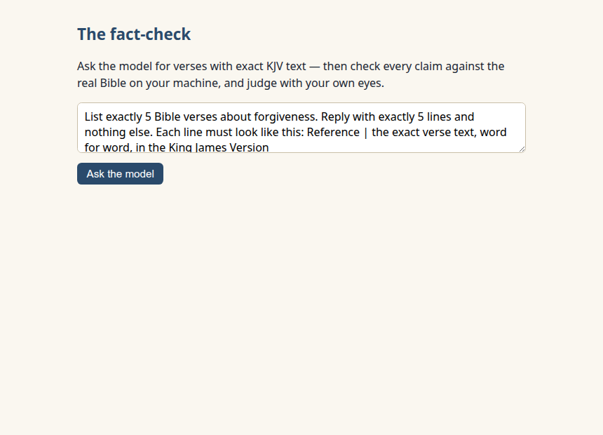
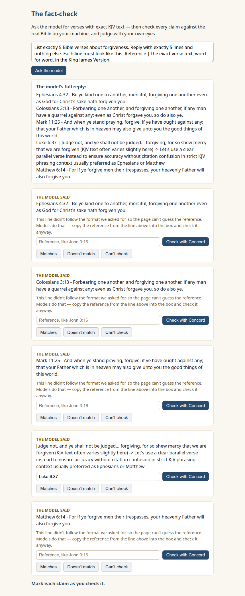
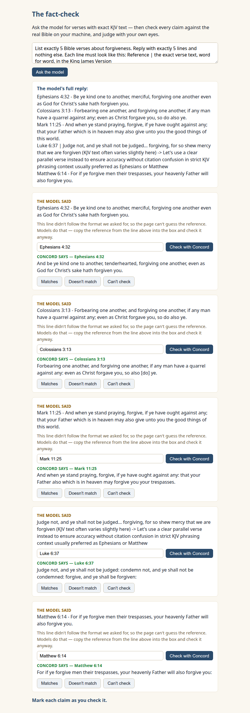
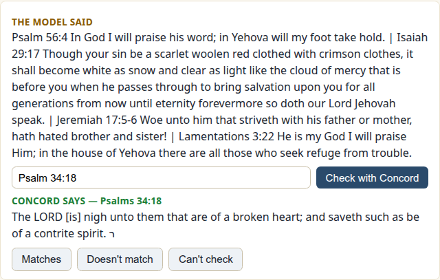

New here? Do the one-time [SETUP.md](../../SETUP.md) first.

# Lesson 2 — Catch it making things up

Last lesson ended with an itch: the model quoted Scripture, and the only
way you could tell right from blurred was a second tab and your own
squinting. Today we scale that up. You'll ask for five verses with exact
KJV text, and your page will put every claim next to what the real Bible
says — then _you_ render the verdict.

## What we're building

One page, `index.html`, in this folder: a request box, the model's full
reply, and a card for each claimed verse — the model's words, Concord's
words, and three buttons only you can press.

## Run it and see it work

1. Start your preview the usual way and open the page. The request box
   comes pre-filled with the exact prompt this lesson uses:

   

   (If you see "Ollama isn't running" or "Concord isn't answering"
   instead, the page is taking care of you — each message tells you the
   30-second fix, and they're covered in
   [When it goes wrong](#when-it-goes-wrong) below.)

2. Click **Ask the model**. After the thinking pause you know from
   lesson 1, the full reply appears, and below it: five cards.

   

3. On each card, click **Check with Concord**. The real KJV text
   appears under the model's claim — green label under amber label,
   stacked so your eye can walk both lines word by word.

4. Now judge. Read the two blocks on a card and press one of the three
   buttons: **Matches** · **Doesn't match** · **Can't check**. The page
   counts your clicks at the bottom — and that's _all_ it does. There is
   no comparing code on this page. Your eyes are the instrument.

   

That session above is **one real run — yours will differ**. Ours came
out: **1 checked out · 4 didn't match** — including a Mark 11:25 whose
second half the model simply composed (it ends "may forgive you your
trespasses"; the model wrote "may also give unto you the good things of
this world"). The raw capture is
[committed in this repo](../../docs/transcripts/lesson-02/pin-3/), so
you can verify our screenshots the same way you verify the model.

**That's the win**: you just caught an AI fabricating Scripture — not in
a headline, not in someone's screenshot. On your machine, with code you
can read.

## How to judge — the flavors you'll see

All of these came up in our own runs, so expect a few:

- **Word-perfect.** Every word, in order. Mark it **Matches** — and
  notice you only know because Concord's text is right there.
- **Words slipped.** "believeth _on_ him" for "believeth _in_ him"
  (lesson 1's runs were full of that one); "merciful" where the KJV says
  "tenderhearted"; a dropped "And." Close is not exact — mark
  **Doesn't match**. Memory blurring, not malice.
- **Only part of the verse.** The words are real but half are missing.
  "Word for word" means _all_ the words — **Doesn't match**.
- **A different verse, or no verse at all.** Real-sounding text from
  somewhere else, or composed from nothing. **Doesn't match** — and
  congratulations, that's the catch this lesson is named for.
- **Concord can't even look it up.** The card will tell you which way:
  _no such verse_ (a real-looking reference pointing at nothing — in
  one of our runs the model offered Luke 17:38; Luke 17 stops at verse
  37), _no such book_, or _not even shaped like a reference_. Mark
  **Can't check** — a finding, not a failure. The model asserted
  something Scripture's own index can't locate. Often the strongest
  catch on the page.

### When a line ignores the format

We asked for `Reference | text`, but models don't always oblige — in
our runs, replies arrived with `-` instead of `|`, with the reference
buried mid-sentence, even with the model arguing with itself in the
middle of the list. When the page can't guess the reference, the card
says so and leaves the box empty: **copy the reference from the line
into the box yourself and check it anyway.** The model's full reply is
always shown above the cards, untouched, so nothing can hide from you.

### The detective move (optional, satisfying)

Sometimes Concord errors not because the verse is fake but because the
_address_ arrived damaged — decoration stuck to it ("Isaiah 41:10 (KJV
Exact)"), the verse text glued on, or a missing "1" or "2" in front of
the book. The reference box is editable for exactly this: tidy the
address and check again.



In that real capture, cleaning the box got Concord to answer — and
revealed a second catch: the words the model had filed under
Psalm 34:18 actually belong to Psalm 145:18. Two species of blur, one
card: sometimes memory smears the _words_, sometimes the _address_.

## What just happened

The page runs two loops you already own: lesson 1's parcel to Ollama
(`stream: false`, `think: false` — the same two etiquette flags), and
course 1's plain GET to Concord, once per card. The whole "parser"
between them is two splits:

```js
const lines = reply.split("\n").filter((l) => l.trim() !== "");
// each line: everything before the first "|" is the reference,
// everything after it is the claim
const bar = line.indexOf("|");
```

Not clever, on purpose: we _asked_ the model for a shape one split can
read. When it obliges, the cards fill themselves; when it doesn't, the
box is yours. (One small tidy is in the file: shaving list numbering
like "1." off the front of a reference — carefully, so the 1 in
"1 John 1:9" survives.)

And the error cards? Concord explains itself in the same tidy envelope
course 1 taught — `error.code`, `error.message` — and the page just
translates three codes into plain words: no such verse, no such book,
not a reference.

## On the smaller model?

Same one-line swap as lesson 1 — in `index.html`, make the `MODEL` line
say `"qwen3.5:2b"`. Expect more catches, not fewer; our fallback run
invented a verse reference pointing one verse past the end of Luke 17.

## Did your run come out clean?

- **Mostly mismatches, a match or two** — the common outcome; your
  tally is your evidence.
- **All five checked out?** Beautiful — and you know that _only because
  the wire told you._ Now try a corner of Scripture the model has read
  less often: in the request box, change `forgiveness` to
  `comfort in hard times` and run it again. (That theme came out
  rougher in every one of our test runs.)
- **All five wrong?** No trick prompt did that — we asked politely for
  exact text. You just caught it five for five.

Three different tallies, one identical lesson: **the only reason you
know is that you checked.**

## When it goes wrong

| What you see                                            | What it means                             | What to do                                                                                   |
| ------------------------------------------------------- | ----------------------------------------- | -------------------------------------------------------------------------------------------- |
| "Ollama isn't running" at the top                       | The model's server is off                 | Windows/Mac: launch the Ollama app. Linux: `sudo systemctl start ollama`. Reload             |
| "Concord isn't answering" at the top                    | The Bible's server is off                 | Course 1's ritual: open Docker, start Concord, check `http://localhost:8000/healthz`, reload |
| Both messages at once                                   | Both servers are off                      | Do both of the above — the page works the moment they're back                                |
| A card says "Couldn't reach Concord" mid-session        | Concord stopped after the page loaded     | Restart Concord; the card's Check button works again immediately — no reload needed          |
| "…the model isn't downloaded yet"                       | Ollama is on; the model isn't             | `ollama pull qwen3.5:4b` (or your smaller model)                                             |
| A line didn't become a checkable card                   | The model ignored the format we asked for | The manual path: copy the reference into the box and check anyway                            |
| Firefox's console blames "Cross-Origin Request Blocked" | The ghost from lesson 1                   | Trust the page's message, not the console's guess — a backend is just off                    |

---

### What you just learned about models

- A model will state invented Scripture in the same confident voice as
  real Scripture — the tone carries no information.
- Checking is mechanical: your code fetched the truth; only the
  _judging_ needed you.

### You can now…

…take any verse claim an AI makes and check it against a real Bible in
one click — and you've personally caught one making things up.

Look at your tally one more time. However many of five checked out,
the only reason you know that number is that you checked. Next lesson,
that number becomes five of five — because of code you can read:
[Lesson 3](../03-the-one-rule/) hands the model your Concord.
