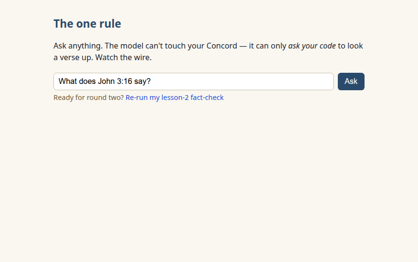
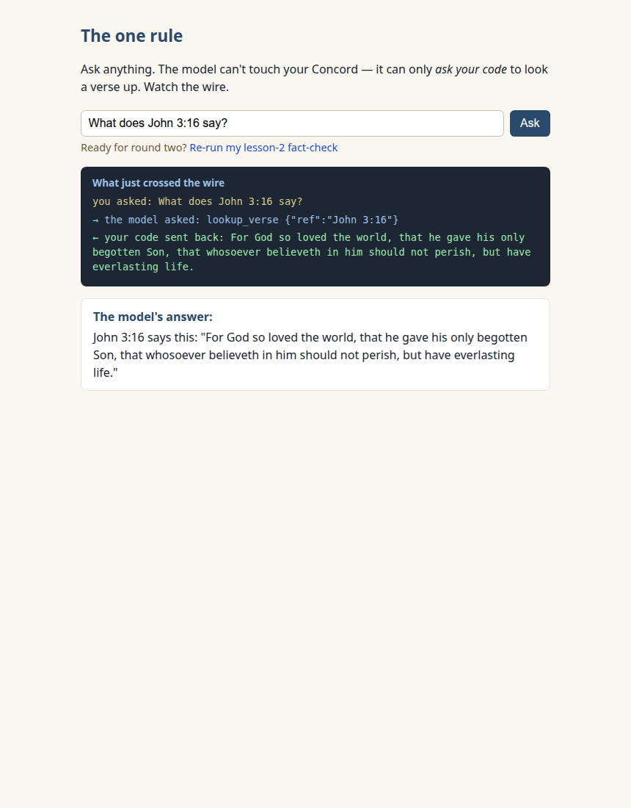
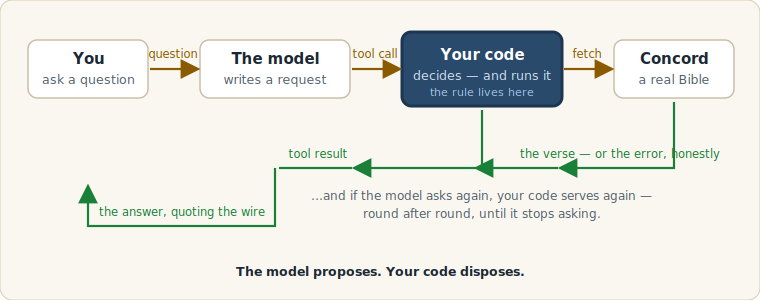
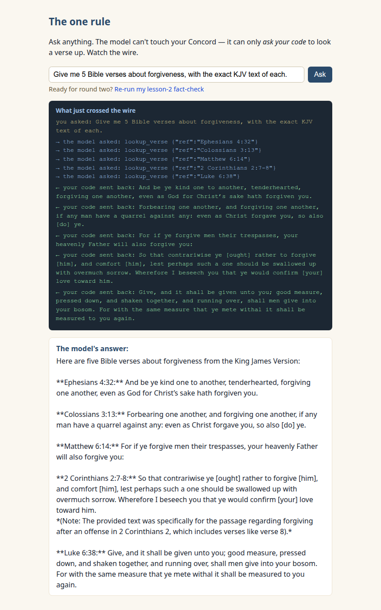

New here? Do the one-time [SETUP.md](../../SETUP.md) first.

# Lesson 3 — Give it a tool

Your lesson-2 tally is the reason this lesson exists. Ours was 1 of 5.
However many of yours checked out, you ended that lesson doing a
machine's job with your own eyes. Today the model stops quoting from
memory — because you're going to hand it your Concord, on one condition,
in code you can read top to bottom.

## What we're building

One page, `index.html`: a question box, the model's answer — and between
them, a dark little panel that shows **everything that crosses the
wire**. That panel is the whole lesson.

## Run it and see it work

1. Open the page the usual way. The box is pre-filled with the question
   from lesson 1: _What does John 3:16 say?_

   

   (Offline messages, if you see them, work exactly as in lesson 2 —
   the fixes are in [When it goes wrong](#when-it-goes-wrong).)

2. Click **Ask** and watch the dark panel:

   ```
   you asked: What does John 3:16 say?
   → the model asked: lookup_verse {"ref":"John 3:16"}
   ← your code sent back: For God so loved the world, that he gave…
   ```

   And then the answer appears — quoting, word for word, the text your
   code fetched:

   

**That's the win — read the panel again.** The model never touched
Concord. It can't. It _wrote a request_, your page decided to honor it,
your page did the fetching (the same course-1 GET you've written
yourself), and the model got handed the result. Every word of Scripture
in that answer came over the wire, and you watched it cross.

## What just happened



The model proposes. Your code disposes. That's the shape of every AI
tool system you'll ever meet — and you just read one in full.

## The code, piece by piece

Open `index.html` — six beats, top to bottom.

### 1. Declare the tool

```js
const TOOLS = [
  {
    type: "function",
    function: {
      name: "lookup_verse",
      description:
        'Look up the exact text of a Bible verse by reference, e.g. "John 3:16".',
      parameters: { ... one required string, ref ... },
    },
  },
];
```

A name, a paragraph, and one parameter. Nothing here _does_ anything —
it's a menu you're about to show the model. (That description paragraph
is doing more work than it looks like; next lesson proves it.)

### 2. The one rule

```js
const RULE =
  "You answer questions about the Bible. Never quote a verse from memory: " +
  "always look it up with the lookup_verse tool, and quote only what it returns.";
```

You wrote what the tool _is_; this sentence is _when to use it_. It
rides along as the chat's first turn (`role: "system"` — the turn that
sets the table before the user speaks).

Does one sentence really matter? We measured it. Same page, same
fact-check request, six runs each way: **without the rule, the model
looked up every verse in only 2 of 6 runs** — in three, it never
touched the tool and quoted from memory, lesson-2 style, blur and all.
**With the rule: 6 of 6.** (The raw runs are
[committed](../../docs/transcripts/lesson-03/compliance-pre-study/),
like always.) One plain English sentence, written by you, changed what
the software did. Hold that thought until lesson 4.

### 3. Send it — the parcel plus one field

```js
body: JSON.stringify({
  model: MODEL,
  messages: messages,
  tools: TOOLS, // ← the only new field since lesson 1
  stream: false,
  think: false,
});
```

### 4. The conditional that is the whole trick

```js
if (reply.tool_calls) {
```

When the model wants a lookup, it doesn't run anything — it can't. Its
reply carries `tool_calls`: a written request, in JSON you can read in
the wire panel. Your code stands between every request and anything
actually happening. That's not a safety feature bolted on; it's the
architecture.

### 5. Your code serves — and keeps serving

```js
for (const call of reply.tool_calls) {
  const looked = await lookupVerse(call.function.arguments.ref);
  messages.push({ role: "tool", tool_name: call.function.name, content: looked.content });
}
continue; // hand the results back and let the model finish
```

One fact-check question makes the model ask five lookups at once — the
loop serves every one (course-1 GETs to Concord), pushes each result
into the conversation as a `role: "tool"` turn, and goes around again.
Your code keeps serving until the model stops asking. (There's a
ten-round cap in the file so a confused model can't keep your page busy
forever — the comment explains, and the cap message is honest.)

And if Concord can't find the verse? **The error goes back as the tool
result, in Concord's own words.** The loop never pretends. More on why
that's a feature in a moment.

### 6. The answer

A reply with no `tool_calls` is the model done asking — that's what
renders. The wire panel, by the way, isn't a log your page writes
separately: it draws itself from the very `messages` list the loop
sends, so what you see is what crossed. Nothing more, nothing less.

## Round two: re-run your fact-check

Click **"Re-run my lesson-2 fact-check"** (it fills the box — the same
ask as lesson 2, minus the formatting scaffolding lesson 2's page
needed\*) and Ask. Now read the wire panel like a receipts ledger: five
requests, five results. Then read the answer and check each quote
against the wire line above it. **Your lesson-2 number — ours was 1 of 5. Count again.**

Ours, this time: **5 of 5** — every quote in the answer matching its
wire line word for word, brackets and all. One real run, yours will
differ:



_\*The funny story: we first re-used lesson 2's prompt verbatim —
"exactly 5 lines and nothing else" — and the model, caught between
"nothing else" and a rule that says always use the tool, refused to
answer at all, six times out of six. The raw refusals are
[committed](../../docs/transcripts/lesson-03/compliance-pre-study/).
Instructions can collide; when they do, the model doesn't split the
difference quietly — it gets weird. Worth remembering._

### What collapsed — and what didn't

What collapsed is fabricated **text**: every quote in the answer
arrived over the wire from your Concord — you watched it cross — with
an address you can check. What's still the model's own judgment:
**which** verses it reached for, and the words around the quotes —
that's still an AI talking. And an address can still blur. But look
what a blurred address does now: it fails out loud, or fetches a real
verse that isn't quite on topic — lesson 2's detective species, now
visible in the wire panel instead of hiding in prose.

## The second chance

When the model sends a damaged address, your code doesn't fix it — it
reports it, in Concord's own words, and **a good error message is the
model's second chance.** What the model does with that chance varies,
and all of these are from our committed runs:

- It **confesses and diagnoses**: one of our runs decorated every
  reference with "(KJV)", got five errors back, and answered: _"I
  apologize for the errors… you could specify 'Ephesians 4:32' without
  including '(KJV)' as part of the reference itself."_ It read
  Concord's error and explained its own mistake.
- It **pivots**: another run sent a whole prayer line as a "reference,"
  read the error, and switched to the real verse behind it.
- It **fixes your typo before asking**: asked for "John 3:99," one run
  quietly looked up John 3:16 instead.

Try it yourself — ask: `What does John 3:99 say?` Your run might
retry, confess, or correct silently; whatever happens, the wire panel
shows the whole exchange, and the commentary it wraps around the
outcome is still an AI talking (ours confidently mis-counted the
chapters of John while apologizing — both runs' raw JSON committed).

## On the smaller model?

Same one-line swap — `MODEL` to `"qwen3.5:2b"`. Ours followed the rule
and quoted the wire, with smaller-brain quirks (asked for five verses,
looked up four). The loop carries it fine.

## When it goes wrong

| What you see                                              | What it means                                                                                                                                                                                                                                                                                                     | What to do                                                                                                                  |
| --------------------------------------------------------- | ----------------------------------------------------------------------------------------------------------------------------------------------------------------------------------------------------------------------------------------------------------------------------------------------------------------- | --------------------------------------------------------------------------------------------------------------------------- |
| The answer quotes verses but the wire panel is empty      | The model answered from memory without using the tool                                                                                                                                                                                                                                                             | It happens — without the rule, half our runs did this; with it, rarely. Ask again, and distrust any quote with no wire line |
| `← your code sent back: no verses found…` in the panel    | The model asked for a verse that doesn't exist — and was told so                                                                                                                                                                                                                                                  | That's the loop working. Watch what the model does with its second chance                                                   |
| "The model kept asking for lookups past ten rounds…"      | The safety cap fired                                                                                                                                                                                                                                                                                              | Not a crash. Ask again                                                                                                      |
| "Ollama isn't running" / "Concord isn't answering"        | The usual suspects                                                                                                                                                                                                                                                                                                | Same fixes as lessons 1–2 — Ollama app / `sudo systemctl start ollama`; Docker + `healthz` for Concord                      |
| `← your code sent back: Couldn't reach Concord…` mid-loop | Concord stopped while the loop was running. The model was told the truth — and watch what it does next: ours apologized, then quoted "from recall" anyway, **in a different translation** (raw run committed). With the tool gone it's lesson 2 all over again, and now you can see it: no verse crossed the wire | Restart Concord and ask again — and never trust a quote without a wire line                                                 |
| Firefox's console blames CORS                             | The lesson-1 ghost                                                                                                                                                                                                                                                                                                | Trust the page, not the console                                                                                             |

---

### What you just learned about tool calling

- A model with a tool doesn't _run_ it — it writes a request, and your
  code decides. The loop is: declare, send, catch the request, execute,
  hand back, repeat until it answers.
- One sentence of plain English (the rule) measurably changed the
  model's behavior — from 2-of-6 to 6-of-6 in our runs.

### You can now…

…read and run the exact pattern behind every "AI with tools" product
you've ever heard of — because you just watched yours work, request by
request, on the wire.

Your fact-check number moved because of code you can read. And that
sentence you wrote — the rule — plus that little description paragraph
on the tool? Next lesson, [Lesson 4](../04-the-menu/) puts _three_
tools on the menu, and your plain English becomes the steering wheel.
