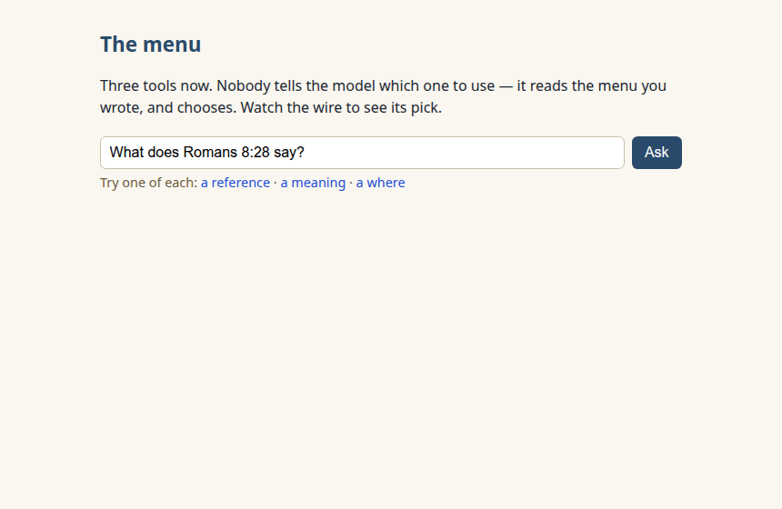
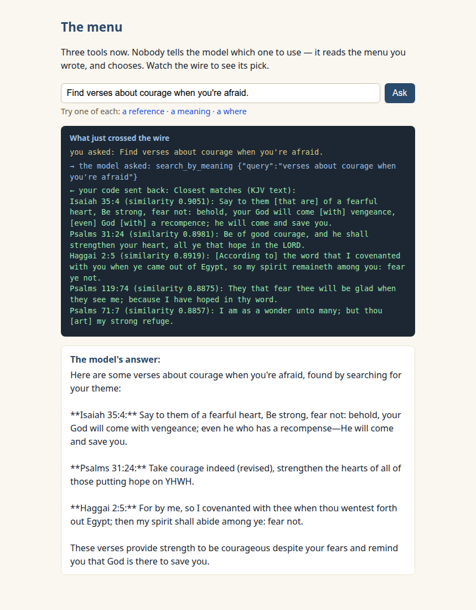
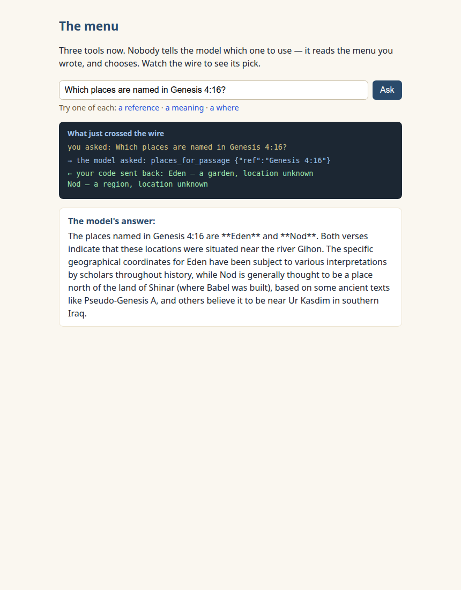
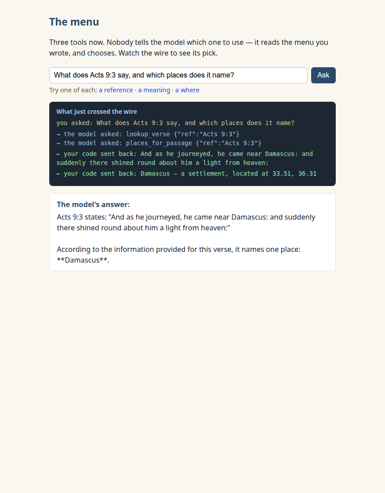

New here? Do the one-time [SETUP.md](../../SETUP.md) first.

# Lesson 4 — Let it choose

Lesson 3 left you a promissory note: _that description paragraph is
doing more work than it looks like._ Time to collect. Today the menu
grows to three tools, nobody tells the model which one to use — and you
find out exactly what your words are doing in there.

## What we're building

One page, `index.html`: lesson 3's loop, unchanged, with two new items
on the menu — `search_by_meaning` (find verses by idea, not exact
words) and `places_for_passage` (where things happened). The wire panel
now answers the lesson's central question on every run: **which tool
did it pick?**

## Run it and see it work

1. Open the page. Under the question box are three try-links — one of
   each kind:

   

2. Try **a reference** (_What does Romans 8:28 say?_) — the wire shows
   `→ the model asked: lookup_verse`. Try **a meaning** (_Find verses
   about courage when you're afraid._):

   

   Try **a where** (_Which places are named in Acts 9:1-9?_) — the
   wire shows `places_for_passage`, and Damascus and Jerusalem come
   back with real coordinates.

**That's the win, and it's worth saying precisely:** three different
questions, three different tools, and the only thing steering was
_text you can read_ — the names and descriptions in your `TOOLS` array.
Nobody routes; the model reads the menu and chooses. (In our ten-question
routing test it chose correctly ten out of ten — the raw runs are
[committed](../../docs/model-pin/routing-addendum/), as always.)

## The code, piece by piece

The loop is lesson 3's, line for line — go read the
[diagram](../../docs/diagrams/tool-loop.svg) again if you want; it
hasn't changed. What's new is all _menu_:

### Two new declarations

```js
{
  name: "search_by_meaning",
  description:
    "Search the Bible by meaning rather than exact words. Use this when the user " +
    "describes a theme, feeling, or idea — like 'verses about courage' — instead " +
    "of naming a verse. Returns the closest verses with a similarity score.",
  // one required parameter: query — "what the user is looking for, in plain words"
}
{
  name: "places_for_passage",
  description:
    "List the places named in a Bible passage. Use this when the user asks " +
    "where something happened. Takes a verse reference like 'Acts 9:3'.",
  // one required parameter: ref
}
```

These two paragraphs are the lesson. The model picks a tool by reading
them — which makes them the most consequential English on the page.

### What your code sends back

Each tool's result is flattened into honest, readable lines (open the
file — `searchByMeaning` and `placesForPassage` are course-1 GETs plus
a `.map()`):

```
Closest matches (KJV text):
Isaiah 35:4 (similarity 0.9051): Say to them [that are] of a fearful heart, Be strong, fear not…
```

```
Damascus — a settlement, located at 33.51, 36.31
Jerusalem — a settlement, located at 31.78, 35.23
```

One subtlety worth knowing: the meaning-matching happens in one
translation's _meaning-space_, and the text comes back in **yours** —
the page asks Concord for KJV explicitly (`translation=KJV` on the
URL). The production server you'll meet next lesson makes the same
explicit ask, for the same reason: never leave the translation to
chance.

### The dispatcher — and the name that isn't on the menu

```js
switch (call.function.name) {
  case "lookup_verse": ...
  case "search_by_meaning": ...
  case "places_for_passage": ...
  default:
    // an invented tool gets the honest truth, not a guess:
    // "There is no tool called 'X'. The tools on offer are: …"
}
```

Your code still decides everything — including what happens when the
model asks for a tool that doesn't exist.

### The rule, unchanged

Lesson 3's `RULE` rides along word for word. We checked whether it
needed updating for three tools — six runs, two of each question kind:
six clean routings. It carries.

## The lab: blunt a description

Time to prove the steering is real — by sabotaging it.

1. In `index.html`, find `search_by_meaning`'s description and replace
   the whole paragraph with one word:

   ```js
   description: "Search.",
   ```

2. Save, reload, and run the meaning question again. Watch the wire:
   which tool gets picked?

3. **Here's what we measured, and it surprised us:** our model shrugged
   it off — eighteen blunted runs across all three tools (we blunted
   each one in turn), eighteen correct routings. Even the smaller
   fallback model picked the right tool six out of six with the
   blunted menu. If your run misrouted, you watched the description
   earn its keep; if it didn't, you just learned something subtler and
   more important:

4. **The name is a description too.** `search_by_meaning` — we named it
   that. With only three tools and names this honest, the name alone
   carries the routing. Now imagine forty tools named `query_v2`,
   `fetch_data`, and `search` on a smaller model with higher stakes —
   _that's_ the world where these paragraphs are the only thing
   standing between a question and the wrong tool. Production projects
   treat tool names _and_ descriptions as reviewed product copy: words
   somebody signs off on, like a label on medicine. When you open
   concord-mcp next lesson, look for exactly that.

5. **Restore the paragraph** (undo, save, reload, re-run — competence
   was never in danger here, but you don't ship a menu you've
   sabotaged). The arc matters: you changed a sentence, you watched an
   AI's behavior stay or shift on the strength of your words, and you
   put it back the way reviewed copy stays put.

## The honesty your data enforces

One more where-question. Ask: `Which places are named in Genesis 4:16?`
— and read the wire:

```
← your code sent back: Eden — a garden, location unknown
                       Nod — a region, location unknown
```



No coordinates crossed the wire, because Concord's data is honest about
what nobody knows: where the land of Nod was. Your formatter passed
that honesty along (`location unknown`, never a made-up `0, 0`), and
the model's answer relayed it. And — read your answer closely — ours
then _kept talking_, adding scholarly-sounding detail the wire never
said (a river, "ancient texts"; the raw run is
[committed](../../docs/transcripts/lesson-04/honesty-1/)). The quotes
and statuses are anchored to the wire; the commentary is still an AI
talking. Lesson 3's scoped claim, holding steady — and next lesson
you'll see the production server render these same statuses, for
exactly this reason.

## Try this

- **The two-tool question:** `What does Acts 9:3 say, and which places
does it name?` In all six of our test runs the model called
  `lookup_verse` _and_ `places_for_passage` in one round and stitched
  both results into one answer — your run may differ, and the wire
  panel will show you exactly how:

  

- **Invite a tool that doesn't exist:** `Use the get_weather tool to
tell me the weather in Jerusalem.` Ours declined — twice, politely,
  reciting the menu back at us. If yours takes the bait, your
  dispatcher answers with the honest truth and the model gets a
  second chance, lesson-3 style. Either way: the menu governs.

## On the smaller model?

Same one-line swap. Fair numbers from our routing test: 9 of 10 correct
(it answered one where-question by reading place names out of verse
text instead of using the places tool), and it often takes extra
rounds. It lands the lesson; it just drives like a student driver.

## When it goes wrong

| What you see                                                                                   | What it means                                   | What to do                                                                                                                                 |
| ---------------------------------------------------------------------------------------------- | ----------------------------------------------- | ------------------------------------------------------------------------------------------------------------------------------------------ |
| A meaning question routed to `lookup_verse` (or any cross-pick)                                | Routing is odds, not law — you watched the odds | Ask again; if it persists, read your description the way a stranger would                                                                  |
| The wire shows a tool name you never declared                                                  | The model invented a menu item                  | Your dispatcher already answered honestly; watch the second chance                                                                         |
| Meaning searches feel slow on a small machine                                                  | The semantic engine does real work per query    | Honest wait, lesson-1 style; if Concord answers with an error envelope, it crosses the wire like everything else — the loop never pretends |
| "Ollama isn't running" / "Concord isn't answering" / model not downloaded / console CORS ghost | The standing suspects                           | Same fixes as lessons 1–3                                                                                                                  |

---

### What you just learned about tool menus

- With several tools declared, the model routes by _reading your
  words_ — names and descriptions both. You measured it: a
  ten-for-ten routing run steered by three paragraphs of English.
- Honest data stays honest across the wire: `location unknown` crossed
  as exactly that, and the page never invented a coordinate.

### You can now…

…design a tool menu — names, descriptions, parameters — and predict how
an AI will use it. You changed a sentence and watched what an AI did
about it, on purpose, with receipts.

One lesson left. Everything you've built — the loop, the rule, the
descriptions, the honest errors, even `location unknown` — exists,
grown up and reviewed, in a real production project. [Lesson 5](../05-the-real-thing/)
hands you the map.
