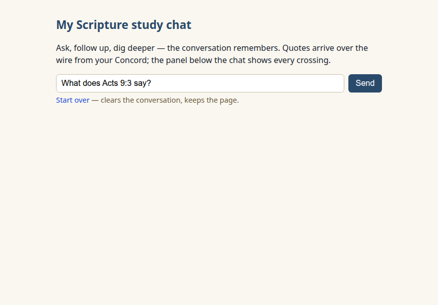
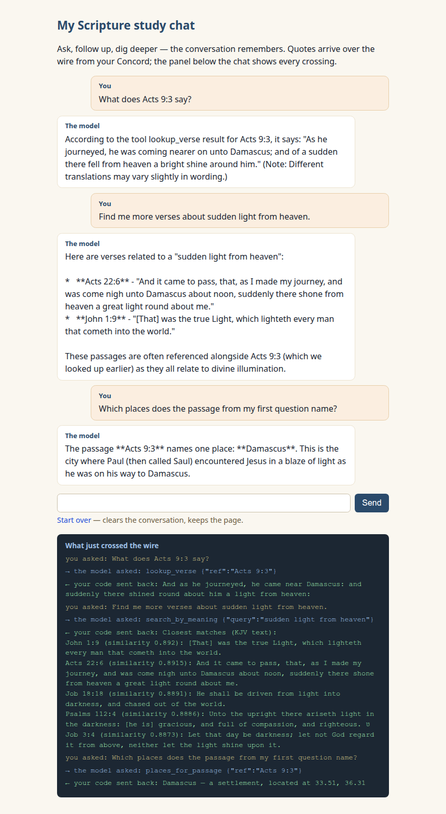
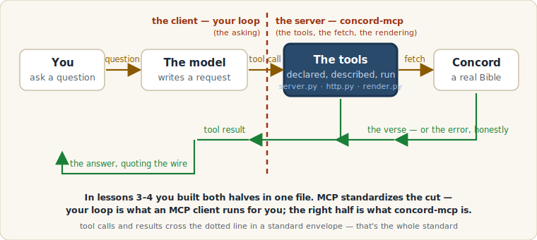

New here? Do the one-time [SETUP.md](../../SETUP.md) first.

# Lesson 5 — It has a name

Four lessons ago you caught an AI inventing Scripture. Then you built
the fix: a loop, a rule, a menu — and errors you could watch become
second chances. Today, two things. First, the page you'd actually show
someone. Then a door opens, and on the other side of it is a production
project you can read — because you've already built every part of it.

## Part 1 — The chat

One page, `index.html`: a real conversation with everything you built
riding underneath.

1. Open the page and ask the pre-filled question (_What does Acts 9:3
   say?_).

   

2. Then follow up — don't repeat yourself, just keep talking:
   _Find me more verses about sudden light from heaven._ And then:
   _Which places does the passage from my first question name?_

   

That third question is the quiet miracle. You said "the passage from my
first question" — and the model knew, because **the conversation
remembers now**. Back in lesson 1 we told you: _a chat is a list of
turns; today ours has exactly one._ That list has been growing all
course — lesson 3 pushed tool calls and results onto it, lesson 4 let
it carry a whole menu's traffic — and today it finally does the thing
lists are for: it keeps everything. Each Send re-sends the whole list,
so the model reads the conversation, not just your last line. (We ran
that exact three-turn script ten times on each course model: the
follow-up resolved to the right passage ten for ten, on both. The raw
runs are [committed](../../docs/model-pin/MULTITURN-ADDENDUM.md), with
one earlier, sloppier phrasing of ours and what it taught us — worth
the read.)

**Two views, one array.** Scroll the chat, then find the same moment in
the wire panel below it. The bubbles and the wire lines are drawn from
the _same_ `messages` array — `renderChat(messages)` and
`renderWire(messages)`, side by side in the file, two filters over one
truth. Nothing on this page exists in two places.

**Make it yours.** Open `index.html` and change the `<h1>` heading —
your name, your study group, your kitchen table. That's the whole edit;
the comment above it is waiting for you. You now have a Scripture chat,
running entirely on your computer, that quotes only what crosses the
wire — and it has your name on it.

## Part 2 — The door

Time to say the thing the course has been circling. The loop you built
— declare tools, send them with a chat, catch the requests, run them,
hand results back — is not a teaching toy. It is, almost exactly, a
standard the AI industry has settled on. It's called **MCP — the Model
Context Protocol** — and you've seen the name on this course's front
door since the README. What you don't know yet is how much of it you'd
recognize.

There's a production MCP server for the exact tools you built:
**[concord-mcp](https://github.com/kbennett2000/concord-mcp/tree/v1.0.0)**.
We're going to read it — at the `v1.0.0` tag, pinned, so every line
this lesson quotes is exactly what you'll see. You install nothing.
It's a walk, not a setup.

### You're about to read Python (you'll be fine)

concord-mcp is written in Python, and four equivalences cover
everything you'll meet: `def` is `function`. The `@mcp.tool(...)` line
sitting above a `def` is a _label_ — it registers the function on the
menu, doing what your JSON declaration did, worn as a name tag. An
`f"..."` string is a template literal that writes `{name}` instead of
`${name}`. And where JavaScript uses braces, Python just indents.
That's the whole phrasebook.

### Stop 1 — The rule, grown up

Open [`src/concord_mcp/server.py`](https://github.com/kbennett2000/concord-mcp/blob/v1.0.0/src/concord_mcp/server.py)
and find the `INSTRUCTIONS` constant near the top. That's the
production system text — your one-sentence `RULE`, grown into a
paragraph that routes a **ten-tool** menu. Read it slowly. Now find the
sentence about `'unknown'`:

> Place statuses and journey attributions are honest: 'unknown' means
> no one knows, never guess coordinates.

You shipped that honesty in lesson 4 — Eden and Nod, location unknown,
crossing your own wire. Here it is as law.

### Stop 2 — The menu, reviewed

Scroll back to the very top of the same file. The first lines of the
docstring:

> Tool descriptions are product copy for the model (ADR 0003). Editing
> one is a reviewed change with rationale, never a drive-by edit.

The lab's moral — as the file's opening law. (Honesty about the
resemblance: this course built your small version to match the real one
on purpose, so that today you'd recognize rather than squint.) Now find
`LOOKUP_VERSE_DESCRIPTION` and read it next to the one you wrote.
Same job, more careful words — and notice how it ends: _"If you don't
have a reference, use search_keyword for exact wording or
search_by_meaning for ideas and themes."_ The descriptions steer
**each other** here. And `search_keyword` — that's a tool you never
built. Ten tools, cross-referencing descriptions: this is the bigger
menu in the wild, the one our blunting lab told you about.

### Stop 3 — The fetch you already wrote

Open [`src/concord_mcp/backends/http.py`](https://github.com/kbennett2000/concord-mcp/blob/v1.0.0/src/concord_mcp/backends/http.py)
and find `semantic_search`. There's a comment in it you could have
written yourself:

> Sent explicitly even when the caller omits it: the endpoint's own
> default is WEB, not our configured default

Your lesson-4 page sends `translation=KJV` on that same URL, for that
same reason. Same endpoint, same decision, same why — theirs just has
an architecture decision record behind it. (While you're there: find
the _"One polite retry … never more"_ comment. Production patience has
a number on it.)

### Stop 4 — The second chance, productionized

Back in `server.py`, find `render_error`. Its docstring: _"errors the
model can self-correct from."_ Lesson 3 in five words. Read the first
case — when Concord is unreachable, the model is told:

> Concord isn't reachable at {exc.url}. Is it running?

Your pages have asked you that exact question since lesson 1. Here,
the question goes to the _model_ — because a good error message is the
model's second chance, and this file is where that beat became a
design rule.

### Stop 5 — Your own sentence, in production

Open [`src/concord_mcp/render.py`](https://github.com/kbennett2000/concord-mcp/blob/v1.0.0/src/concord_mcp/render.py)
and find `render_places`. When a passage names no places, it returns:

> No places are named in {reference}.

Word for word, the line your lesson-4 page prints. Designed kinship,
as we said — but stand here a second anyway: you have, in your editor,
a file that does this job in 30 lines of JavaScript you understand
completely. That's why this one reads like yours.

### Stop 6 — The seam

One question left: if concord-mcp is the tools, the fetch, and the
rendering… who runs the loop?

In lessons 3–4 you built both halves in one file: the loop that asks,
_and_ the tools that answer. **MCP standardizes the cut between them.**
The loop you wrote — send, catch `tool_calls`, execute, push results,
repeat — is what an MCP _client_ (a chat app, an IDE, an assistant)
runs for you, for any server you plug in. Everything to the right of
the dotted line — declared tools with reviewed descriptions, the
backend fetch, the honest rendering — is what an MCP _server_ is. Tool
calls and results cross the line in a standard envelope, and that
envelope is, more or less, the whole standard.

You didn't learn a product today. You learned the cut — and you'd
already built both sides of it.

## When it goes wrong

| What you see                                                                                                       | What it means                                                                                              | What to do                                                                                                                                                                             |
| ------------------------------------------------------------------------------------------------------------------ | ---------------------------------------------------------------------------------------------------------- | -------------------------------------------------------------------------------------------------------------------------------------------------------------------------------------- |
| A turn fails mid-chat with `← your code sent back: Couldn't reach Concord…`                                        | A backend died mid-conversation. **Your history is intact** — the model was told the truth, lesson-3 style | Restart the backend and just say "try that again" — in our captured run, the retry crossed Damascus, coordinates and all ([committed](../../docs/transcripts/lesson-05/midchat-loss/)) |
| Late turns take longer to start, especially with no graphics card                                                  | Each Send re-reads the whole list — by turn 3 ours was ~1,250 tokens of history                            | Normal. If a long chat drags, **Start over** resets the list                                                                                                                           |
| "Ollama isn't running" / "Concord isn't answering" / model not downloaded / console CORS ghost / the ten-round cap | The standing suspects, lessons 1–4                                                                         | The same fixes — and the page never goes blank                                                                                                                                         |

## The close

Course 1 taught you that a server is something you can ask questions.
Course 2 taught you that real code is something you can read. This
course taught you the one idea the moment runs on: **an AI that looks
things up instead of remembering** — and today you read the production
version and recognized your own hands in it.

That's the identity this ladder was building toward, so say it plainly:
_you can read a production AI project — not because anyone made it look
easy, but because you built the small version yourself._

If you want to _run_ the real thing, concord-mcp's
[README](https://github.com/kbennett2000/concord-mcp/tree/v1.0.0#readme)
shows a no-code path — no account, nothing this course asks you to
install; it's there when you're curious. And the quiet delivery has
landed: [recipes.md](../../recipes.md) is the copy-paste material, and
[ideas.md](../../ideas.md) is what to build with it.

What should that be? You have a chat page with your name on it, three
tools you understand to the bone, and a Bible that never lets the
model make things up. Build the thing your study group actually needs.
You're the builder now — that's been the point all along.
